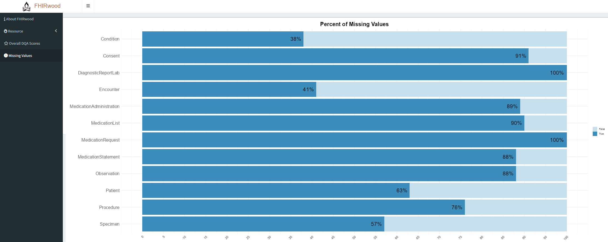
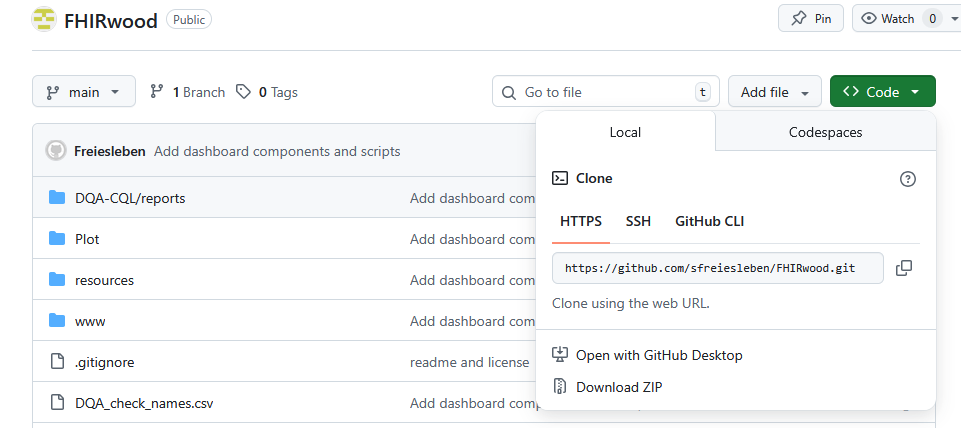

  

# FHIRwood: FHIR Web Output Overview Dashboard

## FHIRwood is an R-based dashboard tool to visualize data quality assessment Json files generated by the DQA-CQL tool

In Germany, Medical Data Integration Centers (MeDICs) are tasked with extracting and transforming clinical routine data into FHIR resources.
Within the Medical Informatics Initiative [(MII)](https://www.medizininformatik-initiative.de/de/start), a data quality assessment (DQA) tool has been developed to assess the data quality of MII - KDS resources in a FHIR server.
The DQA-CQL tool makes use of the Clinical Quality Language [(CQL)](https://cql.hl7.org/) as well as the data quality framework presented in [dataquieR](https://gitlab.com/libreumg/dataquier) to generate Json Files containing the DQA.
FHIRwood retrieves the data contained within these Json files and assembles a dashboard to clearly visualize the DQA.
 

:warning: **Disclaimer**: This repository is a work in progress. If you find a bug or wish to contribute, please scroll down to the `Find a bug? Wish to contribute?` section of this readme.

## Example

  

The above image illustrates the percentage of missing values for the available FHIR resource types.

## Installation

Here is a quick guide on how to download and run a local installation of FHIRwood:

1. Download the repository and unzip it (if needed). To do this, click on the green code button and click "Download ZIP"

  

FHIRwood_download_zip.PNG

1. Enter the App folder of the repository.
1. Run mapPat using R or RStudio.

## Usage
1. 

## Find a bug? Wish to contribute?

## Known issues (work in progress)
1. Clean up code, make code more readable, make code more dfficient.
1. Separate plots that include many DQA checks, thereby eliminating different color palettes.
1. As long as the DQA scores section has not been developed, write a paragraph as to what this section is about.
1. Create DQA scores for every DQA category.
1. Update DQA check names table in about tab. The table should contain the category of the DQA check, the DQA check name, and the resources on which this DQA check is performed.
1. Add additional plots for the DQA checks that are not visualized. For this the DQA check category is needed as well as the complete list possible values a check can have.

## Authors
Author: Sherry Freiesleben  
Email: sherry.freiesleben@med.uni-rostock.de

## License
Attribution-NonCommercial 4.0 International [(CC BY-NC 4.0)](https://creativecommons.org/licenses/by-nc/4.0/deed.en)
